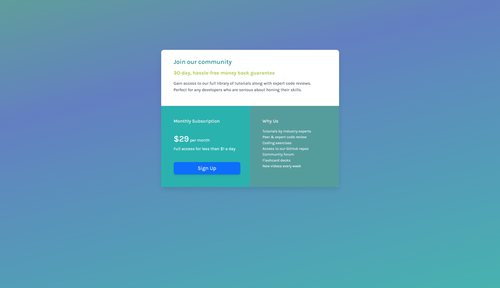
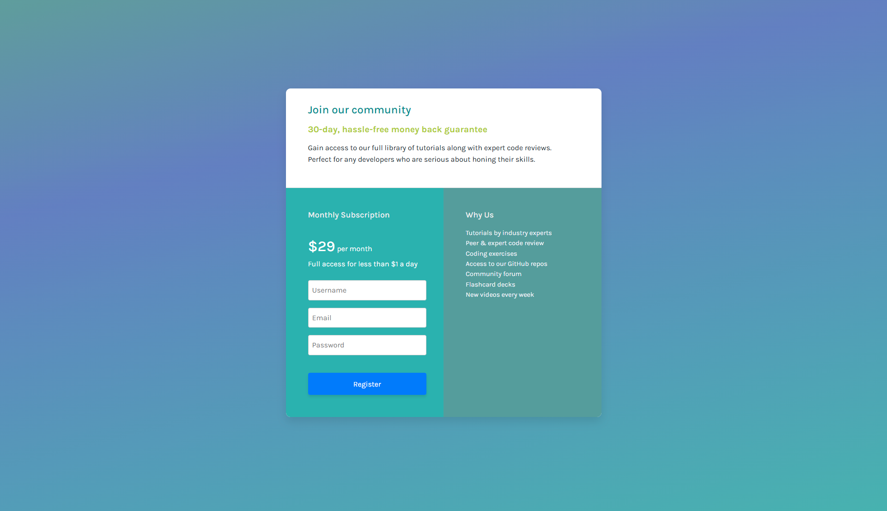

# Frontend Mentor - Single price grid component solution

This is a solution to the [Single price grid component challenge on Frontend Mentor](https://www.frontendmentor.io/challenges/single-price-grid-component-5ce41129d0ff452fec5abbbc). Frontend Mentor challenges help you improve your coding skills by building realistic projects. 

## Table of contents

- [Overview](#overview)
  - [The challenge](#the-challenge)
  - [Screenshot](#screenshot)
  - [Links](#links)
- [My process](#my-process)
  - [Built with](#built-with)
  - [What I learned](#what-i-learned)
  - [Useful resources](#useful-resources)


## Overview

### The challenge

Users should be able to:

- View the optimal layout for the component depending on their device's screen size
- See a hover state on desktop for the Sign Up call-to-action

### Screenshot





### Links

- Solution URL: [https://github.com/npc-makinika/Single-Price-Grid-Component-ver.2.git](https://github.com/npc-makinika/Single-Price-Grid-Component-ver.2.git)
- Live Site URL: [https://npc-makinika.github.io/Single-Price-Grid-Component-ver.2/](hhttps://npc-makinika.github.io/Single-Price-Grid-Component-ver.2)

## My process

### Built with

- Semantic HTML5 markup
- CSS custom properties (variables)
- Flexbox
- Bootstrap 5 – for responsive grid and components
- Mobile-first workflow
- Vanilla JavaScript (DOM manipulation & event handling)
- Google Fonts (Karla)


### What I learned
HTML Structure:
1. Pricing Section with Bootstrap Grid:
```html
<div class="row g-0">
    <section id="section1" class="col-12 col-md-6">
        <div class="pricing-box">
            <h2>Monthly Subscription</h2>
            <p>Full access for less than $1 a day</p>
            <button class="btn btn-primary btn-lg">Sign Up</button>
            <div class="register-form">
                <form id="registerForm">
                    <input placeholder="Username" required><br>
                    <input type="email" placeholder="Email" required><br>
                    <input type="password" placeholder="Password" required><br>
                    <button type="submit" id="registerBtn">Register</button>
                </form>
            </div>
        </div>
    </section>
</div>
```
- row g-0: creates a row for columns and removes the default space (gutters) between them.
- col-12 col-md-6: full-width column on small screens, half-width on medium+ screens.
- pricing-box: container for the subscription info, button, and hidden form.
- register-form: the form is hidden initially and only shows when the user clicks the button.  
 Input Fields: 
  - <input>: box for the user to type something.
  - placeholder="...": shows a hint inside the box (e.g., “Username”).
  - type="..." tells the browser what kind of input it is:
    - text → normal text
    - email → must look like an email
    - password → hides letters so others can’t see them


CSS Highlights:
1. Button Styling:
```css
button {
  cursor: pointer;
  background-color: var(--color-primary);
  color: white;
  border-radius: 4px;
  width: 16rem;
  height: 3rem;
}
```
- Makes the button look clickable and colorful.
- Rounded corners for a softer look.
- "background-color: var(--color-primary);" :
  - sets the background color of an element using a CSS variable called --color-primary
  - var(--color-primary) is a CSS variable that stores a color (or other value) you can reuse.


2. Hidden Form with Flexbox:
```css
.register-form {
  display: flex;
  flex-direction: column;
  display: none; /* hidden initially */
}
```
- Arranges form fields vertically.
- Hidden by default; appears when “Sign Up” is clicked.


3. Responsive Container
```css
.container {
  max-width: 683px;
  margin: 12rem auto;
  background-color: #fff;
  border-radius: 10px;
  box-shadow: 0 10px 20px rgba(0,0,0,0.1);
}
```
- Keeps content centered and constrained in width.
- Adds subtle shadow and rounded corners for a card-like look.
- "rgba(0,0,0,0.1);" : 
   - rgba stands for Red, Green, Blue, Alpha.
   - the first three numbers (0,0,0) define the color (0,0,0 is black).
   - the last number 0.1 is transparency (0 = fully invisible, 1 = fully solid).

4. Flexible box
```css
@media (max-width: 768px){
  .col-md {
    flex: 1 1 0;
  }
 }
```
- makes a box flexible so it can grow or shrink to fit the space.

JavaScript Highlights:
1. Show/Hide Form:
```js
const signUpBtn = document.querySelector('#section1 button');
const registerFormContainer = document.querySelector('.register-form');

signUpBtn.addEventListener('click', () => {
    signUpBtn.style.display = 'none';       
    registerFormContainer.style.display = 'flex'; 
});
```
- Clicking the “Sign Up” button hides the button and shows the form.
- "document.querySelector(...)" - finds the first element that matches the selector.
- ".addEventListener('click', () => { ... })" - “Listens” for a click on the element, and runs the code inside the { ... } when it’s clicked.
- " .style.display = ..." - Changes whether an element is visible or hidden on the page ('none' hides it, 'block' or 'flex' shows it).

2. Form Submission:
```js
const registerForm = document.getElementById('registerForm');
registerForm.addEventListener('submit', (e) => {
    e.preventDefault();
    signUpBtn.textContent = 'Registered';
    setTimeout(() => {
        signUpBtn.textContent = 'Sign Up';
    }, 10000);
    registerFormContainer.style.display = 'none';
    signUpBtn.style.display = 'block';
});
```
- Prevents page reload on form submit (e.preventDefault()).
- Changes button text temporarily to “Registered.”
- Hides the form and shows the button again after 10 seconds.
- (e): the event that triggered the code (click or submit).
- setTimeout(() => { ... }, 10000): waits 10 seconds, then runs the code inside { ... }.
- { ... }: block of code grouping instructions together.
- "registerForm = document.getElementById(...)" - Finds an element by its unique ID on the page (like the <form>).
- textContent = 'Sign Up', 'Registered'; - property that holds all the text inside that element.


### Useful resources
   ### Bootstrap & CSS Resources
1. **Bootstrap:**
- [Bootstrap – Getting Started](https://getbootstrap.com/docs/5.3/getting-started/introduction/) – This helped me understand how to use Bootstrap's grid system and utility classes effectively. It was particularly useful for organizing content and ensuring responsiveness across different screen sizes.
- [Bootstrap 5 Grid Layout – Official Docs](https://getbootstrap.com/docs/5.0/layout/grid/) – Comprehensive guide to Bootstrap’s responsive grid system, breakpoints, and layout options.
- [Bootstrap 5 Grid Basics – GeeksforGeeks](https://www.geeksforgeeks.org/bootstrap/bootstrap-5-layout-gutters/) – Explains how to add and customize gutters in Bootstrap 5 layouts.
- [Bootstrap 5 Grid Basics – W3Schools](https://www.w3schools.com/bootstrap5/bootstrap_grid_basic.php) – Beginner-friendly introduction to the Bootstrap 5 grid system.

2. **CSS Styling & Layout:**
- [Google Fonts](https://fonts.google.com/) – This resource was invaluable for integrating custom fonts into my project.
- [CSS Tricks – Flexbox Guide](https://css-tricks.com/snippets/css/a-guide-to-flexbox/) – Helped me understand how to align and distribute space among items in a container, essential for the form and pricing box layout.
- [CSS Tricks – Media Queries Guide](https://css-tricks.com/snippets/css/media-queries-for-standard-devices/) – Reference for setting up media queries and ensuring layouts look good on different screen sizes.
- [MDN Web Docs – CSS Media Queries](https://developer.mozilla.org/en-US/docs/Web/CSS/CSS_media_queries/Using_media_queries) – Crucial for applying different styles based on screen size, enabling responsive design.
- [MDN Web Docs – CSS Variables](https://developer.mozilla.org/en-US/docs/Web/CSS/Using_CSS_custom_properties) – Learn how to define and reuse colors and other values in CSS (`var(--color-primary)`).
- [MDN Web Docs – box-shadow](https://developer.mozilla.org/en-US/docs/Web/CSS/box-shadow) – Learn how to add shadows to elements, like the container and buttons, to create depth.
- [MDN Web Docs – border-radius](https://developer.mozilla.org/en-US/docs/Web/CSS/border-radius) – Learn how to round corners of elements, like buttons and containers.
- [MDN Web Docs – CSS Display](https://developer.mozilla.org/en-US/docs/Web/CSS/display) – Learn how to show/hide elements and use flex layouts (`display: none`, `display: flex`).
- [MDN Web Docs – Input](https://developer.mozilla.org/en-US/docs/Web/HTML/Element/input) – Learn about different input types and attributes like `placeholder`, `required`, `type="email"`, and `type="password"`.
- [CSSmatic – Border Radius Generator](https://www.cssmatic.com/border-radius) – Helpful for experimenting and generating CSS styles such as border radius, box shadow, and more.

  ### Useful JavaScript Resources
3. Javascript: 
- [MDN Web Docs – JavaScript](https://developer.mozilla.org/en-US/docs/Web/JavaScript) – Official documentation with clear explanations and examples for all JavaScript concepts.  
- [W3Schools – JavaScript Tutorial](https://www.w3schools.com/js/) – Beginner-friendly tutorials with interactive examples you can try in the browser.  
- [JavaScript.info](https://javascript.info/) – Step-by-step guide covering everything from basics to advanced JavaScript topics.  
- [freeCodeCamp – JavaScript](https://www.freecodecamp.org/learn/javascript-algorithms-and-data-structures/) – Free coding exercises and challenges to practice JavaScript hands-on.  
    #### DOM Selection & Manipulation
- [MDN Web Docs – Document Object Model (DOM)](https://developer.mozilla.org/en-US/docs/Web/API/Document_Object_Model) – Learn how to select and manipulate HTML elements with JavaScript, like buttons and forms.  
- [W3Schools – JavaScript HTML DOM](https://www.w3schools.com/js/js_htmldom.asp) – Simple examples for selecting elements, showing/hiding content, and responding to user actions.  
    #### Events & Interactivity
- [MDN Web Docs – addEventListener](https://developer.mozilla.org/en-US/docs/Web/API/EventTarget/addEventListener) – Official guide on how to listen for clicks, form submissions, and other events.  
- [JavaScript.info – Events](https://javascript.info/events) – Beginner-friendly guide to JavaScript events, including click and submit events.  
    #### Forms & Input Handling
- [MDN Web Docs – HTMLFormElement](https://developer.mozilla.org/en-US/docs/Web/API/HTMLFormElement) – Learn how to handle form submissions, prevent default actions, and access form inputs.
    #### Timing & Delays
- [MDN Web Docs – setTimeout](https://developer.mozilla.org/en-US/docs/Web/API/setTimeout) – Learn how to run code after a delay, like showing “Registered” for 10 seconds before reverting to “Sign Up”.  
- [JavaScript.info – Timers](https://javascript.info/settimeout-setinterval) – Beginner-friendly guide explaining `setTimeout` and `setInterval` for delaying or repeating actions in JavaScript.
    #### DOM Text Content
- [MDN Web Docs – Node.textContent](https://developer.mozilla.org/en-US/docs/Web/API/Node/textContent) – Learn how to get or set the text inside an HTML element, like changing the text of a button dynamically.
